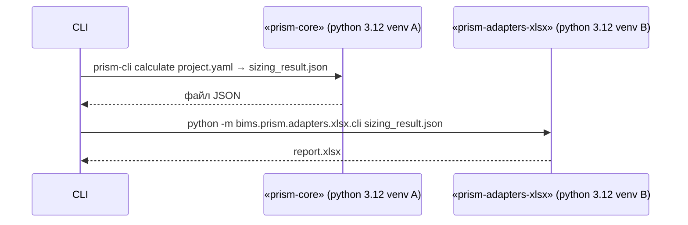

# Архитектура отчётных провайдеров PRISM

> **Версия 0.2 — актуализировано после перехода на multi-package layout, 09 июл 2025**

---

## 1. Цель и рамки документа

* Описать **архитектуру** модулей генерации отчётов (XLSX / PDF + HTML) и показать, как они удовлетворяют собранные требования.
* Зафиксировать **интеграционные точки** между `core-model` (движок расчёта) и адаптерами.
* Обосновать выбор технологий, структуру каталогов и правила расширения.

---

## 2. Требования ↔ реализация — актуальное состояние

| Категория                       | Требование (из Business Intro)                                             | Как соблюдаем в дизайне                                                                                               |        |
| ------------------------------- | -------------------------------------------------------------------------- | --------------------------------------------------------------------------------------------------------------------- | ------ |
| **Читаемость**                  | Документы читают менеджеры без ИТ-бэкграунда.                              | Таблицы + пояснительный текст; pre-set корпоративных стилей.                                                          |        |
| **Официальный стиль**           | Встраивание в тендерный пакет; «как юр. документ».                         | Шаблоны стилей (шрифты, колонтитулы, логотипы).                                                                       |        |
| **Многоуровневая терминология** | Сейчас: Container / Service (уровни 2-3). Далее: VM-Layer, Hardware-Layer. | Отдельный слой маппинга «уровень → термины» (`bims.prism.common.mapping`).                                            |        |
| **Расширяемость**               | Поддержать другие форматы (ODF, PPTX, …).                                  | Фасад `build_report()` + паттерн *Strategy*; новый адаптер подключается декларативно.                                 |        |
| **Изоляция зависимостей**       | Ядро и каждый адаптер ставятся отдельно (может быть на другом языке).      | Три независимых wheel: **prism-core**, **prism-common**, **prism-adapters-xlsx**.<br>CLI-интеграция через JSON-файлы. |        |
| **CI / Snapshot-тесты**         | Проверка, что отчёт пересоздаётся без диффов.                              | `pytest-snapshot`; байтовая проверка XLSX, растровая — PDF.                                                           |        |
| **Self-service**                | SPA запрашивает отчёт on-demand.                                           | Spring-Service отдаёт файл по REST \`GET /reports/{id}?format=xlsx                                                    | pdf\`. |

---

## 3. Входные данные для адаптеров

| Источник                       | Тип / Схема                              | Где лежит схема                               | Используется для            |
| ------------------------------ | ---------------------------------------- | --------------------------------------------- | --------------------------- |
| **`SizingResult`**             | JSON-объект, `sizing_result.schema.json` | `prism-common/src/bims/prism/common/schemas/` | Все числовые расчёты        |
| **`Project`** *(optional)*     | JSON-объект, `project.schema.json`       | idem                                          | Заголовки, список зон       |
| **`BlueprintIndex.overrides`** | Часть `SizingResult.warnings`            | уже в JSON-результате                         | Примечания / раздел «Риски» |
| **Theme**                      | YAML `theme.yaml`                        | `prism-adapters-report/themes/`               | Цвета, шрифты               |

> Адаптер **не импортирует `core-model`**.
> Он валидирует входной JSON по схеме из **prism-common** и берёт только нужные поля.

---

## 4. Взаимодействие модулей



* **Разные venv / образы** ⇒ независимые зависимости.
* В контейнере «всё-в-одном» каждый адаптер — отдельный слой + хелпер-скрипт.

### 4.1 Фасад внутри пакета `prism-adapters-xlsx`

```python
# bims.prism.adapters.xlsx.__init__.py
def build_report(
    result_json: dict,
    *,  # все параметры только keywords
    theme: str = "default",
) -> bytes: ...
```

> Переиспользуется CLI-обвязкой (`python -m bims.prism.adapters.xlsx.cli …`) и Spring-Service через subprocess.

---

## 5. Выбор технологий — без изменений

| Подсистема           | Библиотеки / Форматы                     | Причина выбора                          |
| -------------------- | ---------------------------------------- | --------------------------------------- |
| **XLSX-Adapter**     | `openpyxl`, `pandas`, `jinja_excel`      | Полный контроль стилей, write-only API. |
| **PDF/HTML-Adapter** | `Jinja2` → `WeasyPrint`                  | HTML + CSS → PDF без LaTeX.             |
| **i18n слой**        | `gettext` + JSON словари                 | Совместно с фронтендом (react-i18next). |
| **Тесты**            | `pytest`, `pytest-snapshot`, `pdf2image` | Байтовый diff XLSX, растровый diff PDF. |
| **CI**               | Re-use GH-Action (lint, test, build)     | Единый шаблон.                          |

---

## 6. Поддержка будущих уровней терминологии

| Будущий уровень | Что добавит `core-model` | Что делает адаптер                  |
| --------------- | ------------------------ | ----------------------------------- |
| **VM-Layer**    | `SizingResult.vm_totals` | Добавить колонку / ячейку в шаблон. |
| **Hardware**    | `SizingResult.hw_totals` | Новый лист «Hardware BoM».          |

Адаптер остаётся «тупым» — только рендер.

---

## 7. Каталоги после refactor

```
prism-adapters-xlsx/
├─ src/
│   └─ bims/prism/adapters/xlsx/
│       ├─ __init__.py       # build_report
│       ├─ builder.py        # XlsxAdapter
│       ├─ cli.py            # CLI wrapper
│       └─ templates/
│           ├─ totals.xml.j2
│           └─ ...
├─ tests/
│   ├─ unit/
│   ├─ integration/
│   └─ __snapshots__/
└─ pyproject.toml            # wheel prism-adapters-xlsx
```

(Аналогичная структура появится для `prism-adapters-report`.)

---

## 8. Потоки расширения — без изменений

| Что меняем         | Куда писать                         | Типовой PR                         |
| ------------------ | ----------------------------------- | ---------------------------------- |
| Новая колонка XLSX | `templates/*.xml.j2` + `builder.py` | `feat(xlsx): add column node-pool` |
| Новый PDF-theme    | `report/themes/<name>.yaml` + CSS   | `feat(pdf): corporate-blue theme`  |
| Новый язык RU→ES   | `locales/es/*.po`, шаблоны ×2       | `i18n: add Spanish`                |

---

## 9. Открытые вопросы (актуально)

1. **Кириллические шрифты для PDF** — используем Noto Sans (OFL) → добавить в Docker-image.
2. **Перформанс XLSX > 10 000 строк** — `openpyxl.Workbook(write_only=True)` + stream-write.
3. **Audit SHA исходных YAML** — сохраняем в Postgres таблицу `report_meta` (`service` уровень).

---

## 10. Соответствие требованиям

*Адаптеры удовлетворяют требованиям (§ 2) за счёт*:

* независимых wheel + CLI ↔ JSON контрактов,
* общего пакета **prism-common** для схем и утилит,
* фасада `build_report()` + шаблон/рендер separation,
* snapshot-тестов и унифицированного CI.
