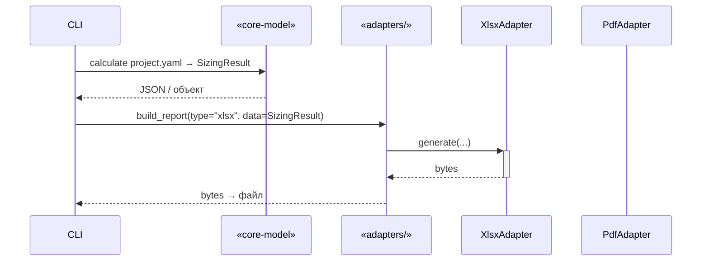

# Архитектура отчётных провайдеров PRISM

> Версия 0.1 — черновик, 07 июл 2025

---

## 1. Цель и рамки документа

* Описать **архитектуру** модулей генерации отчётов (XLSX / PDF + HTML) и показать, как они удовлетворяют собранные требования.
* Зафиксировать **интеграционные точки** с `core-model`.
* Обосновать выбор технологий, принятую структуру каталогов и правила расширения.

---

## 2. Краткое напоминание о требованиях

| Категория                       | Требование                                                                                         | Как учитываем в дизайне                                                       |        |
| ------------------------------- | -------------------------------------------------------------------------------------------------- | ----------------------------------------------------------------------------- | ------ |
| **Читабельность**               | Документы читают менеджеры без ИТ-бэкграунда.                                                      | Табличные и графические разделы с пояснительным текстом.                      |        |
| **Официальный стиль**           | Встраивание в тендерный пакет; должен выглядеть «как юр. документ».                                | Корп. шаблоны стилей: шрифты, колонтитулы, логотипы.                          |        |
| **Многоуровневая терминология** | Сейчас: Container Orchestration / Service Component (3A/3B). В будущем: VM-Layer и Hardware-Layer. | Слой маппинга «уровень → термины» вынесен в отдельный пакет `mapping/`.       |        |
| **Расширяемость**               | Легко добавить новый формат (ODF, PPTX…).                                                          | Единый «шлюз» `ReportAdapter` (см. § 4.3).                                    |        |
| **Автоматизация CI**            | Snapshot-тесты, проверка, что отчёт пересоздаётся без диффов.                                      | Папка `tests/snapshots/`, hash-проверка XLSX, PDF‐render → PNG для сравнения. |        |
| **Self-service**                | SPA будет запрашивать отчёт on-demand.                                                             | REST / gRPC endpoint \`GET /reports/{id}/download?type=xlsx                   | pdf\`. |

---

## 3. Входные данные для адаптеров

| Источник                       | Тип / Схема                                       | Где объявлена                                    | Используется для           |
| ------------------------------ | ------------------------------------------------- | ------------------------------------------------ | -------------------------- |
| **`SizingResult`**             | JSON-объект, схема `sizing_result.schema.json`    | `core-model/src/.../schemas/sizing_result*.json` | Все числовые расчёты       |
| **`Project`**                  | JSON-объект, схема `project.schema.json` *(опц.)* | idem                                             | Заголовки, зоны            |
| **`BlueprintIndex.overrides`** | Часть `warnings`                                  | Из `SizingResult.warnings.overrides`             | Примечания, раздел «Риски» |
| **Тема оформления**            | YAML (`theme.yaml`)                               | `adapters/report/themes/`                        | Цвета, шрифты              |

> Адаптер **НЕ** должен импортировать весь код `core-model`. Достаточно:
>
> 1. Десериализовать `SizingResult` (Pydantic модель уже сгенерирована).
> 2. (Опционально) прочитать `Project` для названия заказчика и зон.

---

## 4. Взаимодействие модулей



### 4.1 API «core-model → adapters»

```python
def build_report(
    result: SizingResult,
    *,
    fmt: Literal["xlsx", "pdf", "html"],
    project: Project | None = None,
    theme: str = "default",
) -> bytes: ...
```

### 4.2 Варианты вызова

* **CLI** (`prism-cli report`) — читает JSON с диска.
* **Service** (Spring) — делает gRPC-call к Core-Model, затем локально вызывает `build_report`.
* **Batch-job** — импортирует `adapters.xlsx` напрямую (Python‐only сценарий).

### 4.3 Паттерн «Facade + Strategy»

```
ReportFacade
└─┬─ XlsxAdapter      (openpyxl + pandas)
  └─ PdfAdapter       (Jinja2 + WeasyPrint)
```

*Фасад* выбирает стратегию по параметру `fmt` и скрывает детали форматирования.

---

## 5. Выбор технологий

| Подсистема                 | Библиотеки / Форматы                                     | Причина выбора                                                                                  |
| -------------------------- | -------------------------------------------------------- | ----------------------------------------------------------------------------------------------- |
| **XLSX-Adapter**           | `openpyxl`, `pandas`, `jinja_excel` *(template helpers)* | • Полный контроль стилей (табличная верстка, слияние ячеек).<br>• Пакет уже в use-case MVP 0.2. |
| **PDF/HTML-Adapter**       | `Jinja2` (HTML templates) → `WeasyPrint`                 | • Отделение логики от шаблона.<br>• WeasyPrint = CSS + HTML → PDF без LaTeX.                    |
| **Перекрёстный слой i18n** | `gettext` заглушки + JSON словари                        | • Совместим с future RU/EN/….<br>• Используется теми же словарями, что и SPA.                   |
| **Тестирование**           | `pytest`, `pytest-snapshot`, `pdf2image`                 | • Байт-точный diff для XLSX; растровый diff для PDF (stable).                                   |
| **CI**                     | Re-use GitHub Action шаблона (`lint`, `test`, `build`)   | • Единообразие со `core-model`.                                                                 |

---

## 6. Расширение терминологических уровней

| Будущий уровень | Требуется выделить новые поля | Где трансформируем                                   | Пример                    |
| --------------- | ----------------------------- | ---------------------------------------------------- | ------------------------- |
| **VM-Layer**    | vCPU, vRAM, vDisk GB          | `core-model` (новый step) ➜ `SizingResult.vm_totals` | «8 vCPU / 32 GiB на зону» |
| **Hardware**    | CPU socket, RAM DIMM, RackU   | idem ➜ `SizingResult.hw_totals`                      | «2 × 1U сервер по 64 GB»  |

Adapter-слой остаётся **«тупым»**: он рендерит всё, что приходит в `SizingResult`.
Добавление новых уровней = только изменение шаблонов + stylesheet, без кода адаптера.

---

## 7. Структура каталогов адаптера

```
adapters/
├── __init__.py
├── facade.py          # build_report(...)
├── xlsx/
│   ├── __init__.py
│   ├── templates/     # Jinja-Excel XML templates
│   ├── builder.py     # XlsxAdapter
│   └── styles.py      # corporate palette
├── report/            # PDF / HTML
│   ├── __init__.py
│   ├── templates/     # Jinja2 (HTML + CSS)
│   ├── builder.py     # PdfAdapter
│   └── themes/        # default.yaml, dark.yaml …
└── tests/
    ├── unit/
    ├── integration/
    └── snapshots/
```

---

## 8. Потоки расширения

| Что меняем           | Куда писать                         | Типовой Pull-Request                |
| -------------------- | ----------------------------------- | ----------------------------------- |
| Новый столбец в XLSX | `templates/*.xml.j2` + `builder.py` | feat: xlsx add column **node-pool** |
| Новый theme PDF      | `report/themes/<name>.yaml` + CSS   | feat: pdf theme «corporate-blue»    |
| Доп. язык RU→ES      | `locales/es/*.po`, шаблоны ×2       | i18n: add spanish translation       |

---

## 9. Открытые вопросы

1. **Шрифты с кириллицей** для PDF — лицензия? Noto Sans + OFL.
2. **Скорость генер.** больших XLSX (>10 000 строк) — возможна оптимизация `write_only=True` в openpyxl.
3. **Versioning отчётов** в базе (`service`) — куда сохранять SHA входных YAML? (см. core-model § 1 «Прослеживаемость»).

---

## 10. Сводка соответствия требованиям

*Модуль адаптеров удовлетворяет всем исходным требованиям (§ 2) за счёт*:

* многоуровневой схемы данных,
* фасадного API,
* раздельных слой шаблон / данные / рендер,
* строгих snapshot-тестов и одинакового CI-пайплайна.

---