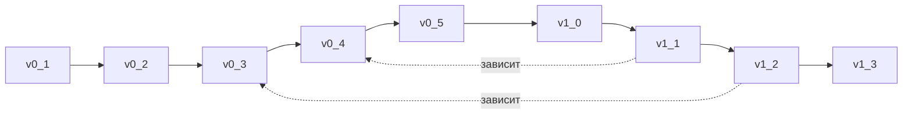

# PRISM — Дорожная карта

> *Последнее обновление: 05 июл 2025*

---

## 1. Стратегия релизов

* **Версии 0.x** — *MVP‑итерации*: каждый минор добавляет полнофункциональный вертикальный срез (Core ⇆ Adapters ⇆ Service ⇆ SPA).
* **Версия 1.0** — первая промышленная поставка (используется минимум одним внешним заказчиком в PROD).
* **Версии 1.x** — инкрементальные улучшения (интеграция IaC, безопасность, подпись PDF).
* **Версии 2.x** — функции оптимизации стоимости и runtime‑фидбек (не планируется в текущем горизонте).

> **Time‑box**: 2‑недельные спринты, демо — в конце каждого релиза «0.x».

---

## 2. Хронология версий

| Версия          | Ориентир. спринты | Основные цели                        | Критерии «Done»                                                                                                                                   |
|-----------------|----------------------|--------------------------------------| ------------------------------------------------------------------------------------------------------------------------------------------------- |
| **0.1**         | 1–2                  | Core‑Model MVP + CLI                 | • YAML‑схема + 80 % формул. • `prism-cli calculate demo.yaml` выдаёт JSON. • 50 % юнит‑теста покрытия.                                      |
| **0.2**         | 3                    | XLSX‑Adapter                         | • openpyxl экспорт с 3 листами. • Golden‑file snapshot‑тесты. • Пример `acme.yaml` + `acme.xlsx`.                                           |
| **0.3**         | 4                    | PDF/HTML‑отчёт                       | • WeasyPrint шаблон с бренд‑стилем. • CLI опция `--pdf`. • Док‑пример в `examples/`.                                                        |
| **0.4**         | 5–7                  | Spring Service MVP                   | • gRPC proxy к Core‑Model. • Auth via Keycloak. • CRUD Customer/Project/Zone. • Postgres Flyway миграции. • OpenAPI doc.              |
| **0.5**         | 8–10                 | React SPA MVP + i18n                 | • RU UI + переключатель EN. • Форма параметров + live‑валидация. • «Скачать XLSX / PDF». • E2E тест (Playwright).                        |
| **1.0**         | 11–12                | PROD‑готовность                      | • Helm‑chart + dev/prod values. • CI/CD GitHub → Kind cluster. • Пилот на 1‑м внешнем заказчике. • Док‑пакет (install guide).            |
| **1.1**         | 13–14                | Terraform Provider                   | • Go‑provider (`prism_sizing` data‑source, `prism_report` resource). • Док «How‑to integrate IaC». • Published в HashiCorp Registry (beta). |
| **1.2**         | 15                   | PDF‑подпись                          | • Подпись GOST ЭП (CAdES) или PAdES. • Конфигурация ЦТ. • Unit‑тест mock CAs.                                                               |
| **1.2.1**       | 15-b                 | gRPC streaming progress              | • Реализация server-stream для больших отчётов. |
| **1.3**         | 16                   | UX-polish & perf                     | • Сводный Dashboard метрик. • UI-оптимизации (lazy loading). |
| **2.0 (draft)** | —                    | Cost‑Optimization & Runtime Feedback | • Сравнение планового и фактического потребления. • Рекомендации по оптимизации.                                                               |

*Расчёт спринтов базируется на 1 команде ≤ 5 разработчиков; при расширении ресурса сроки могут сдвигаться вперёд.*

---

## 3. Расширенный Backlog

| Приоритет | Эпик / Фича                | Описание                                                      | Пример ценности              |
| --------- | -------------------------- | ------------------------------------------------------------- | ---------------------------- |
| **P0**    | AWS‑S3 profile, FS profile | Полная поддержка двух хранилищ; профили переключаются в YAML. | Заказчики без S3.            |
| **P0**    | Module‑graph editor        | UI‑визуализация зависимостей (business → technical → infra).  | SRE быстрее дебажит граф.    |
| **P1**    | Multi‑tenant billing       | Учёт CPU/RAM/IOPS на проект → экспорт в фин. системы.         | Сквозная экономика проектов. |
| **P1**    | Advanced HPA sizing        | Автогенерация HPA/VPA параметров из пиковых RPS.              | Оптимум ресурсов в k8s.      |
| **P2**    | Azure Blob profile         | Поддержка Azure‑клиентов.                                     | Расширяем рынок.             |
| **P2**    | DR‑scenario wizard         | UI‑мастер расчёта DR в отдельном DC.                          | Быстрый ответ на RFP.        |

---

## 4. Граф зависимостей релизов

> *Mermaid‑граф будет рендериться в MkDocs GUI.*

---

## 5. Интеграция с CI/CD

| Релиз   | Тег      | Автоматические шаги                                  | Артефакты                                        |
| ------- | -------- | ---------------------------------------------------- | ------------------------------------------------ |
| **0.x** | `v0.x.*` | Docker build + GHCR, GitHub Release XLSX/PDF примеры | `core-model:<tag>`, `service:<tag>`, `spi:<tag>` |
| **1.x** | `v1.x.*` | Доп. шаг: Helm‑chart publish                         | Chart repo `oci://ghcr.io/bims/prism`            |

---

## 6. KPI отслеживания

| KPI                             | v1.0 Target | v1.2 Target |
| ------------------------------- | ----------- | ----------- |
| Время генерации отчетов         | ≤ 30 c      | ≤ 10 c      |
| Покрытие unit‑tests             | ≥ 70 %      | ≥ 80 %      |
| Mean Time to PR merge           | ≤ 2 дня     | ≤ 1 дня     |
| Успешные деплой‑pipeline (main) | ≥ 95 %      | ≥ 98 %      |

---

## 7. Обновление документа

* Изменения дорожной карты фиксируются Pull Request‑ами. 
* Версия документа равна последнему тегу git‑релиза.
